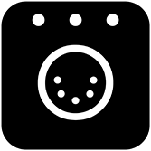

**OLA Trigger config to control Zigbee lights, scenes, power plugs and dimmers using a Philips Hue bridge with DMX (Art-Net, sACN or via DMX input)**

Beta version revised for [Hue API V2](https://developers.meethue.com/new-hue-api/)  

There is only one lamp, one power plug and ten scenes in this config but you can easy add more or contact me for a custom solution.  
  
Please note that the Hue bridge has some frame rate limits.
> The REST API should not be used to send a continuous stream of fast light updates for an extended period of time,
for that use case you should use the dedicated Hue Entertainment Streaming API.  

Check out the [Hue Developer site](https://developers.meethue.com) for more information.  
If you want to use the Entertainment Streaming API with DMX have a look at the project [ArtNet Hue Entertainment](https://github.com/jeffreykog/artnet-hue-entertainment)

**Requirements**

* [OLA](https://www.openlighting.org/ola/)
* [curl](https://curl.haxx.se/)
* [Philips Hue bridge](https://www2.meethue.com)  

**Installation**
  
* Download the [hue_api_v2_dmx.conf](hue_api_v2_dmx.conf) and edit the configuration section

[OLA trigger documentation](https://www.openlighting.org/ola/advanced-topics/ola-dmx-trigger/)

**Usage** 

* Before running ola_trigger, make sure that olad is running and the universe has been configured with a DMX512 source.  
The config file is provided on the command line:

`ola_trigger hue_api_v2_dmx.conf`
